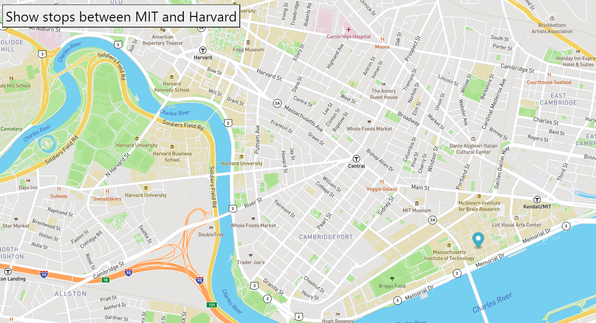

# **MIT2Harvard**

This project demonstrate geospatial location of MBTA bus stops from MIT to Harvard utilizing mapbox. In this project coordinates for MBTA stops are overlaid on top of the map provided by <a href="https://www.mapbox.com/about/company//"> mapbox </a>.

# How to Run
This project can be directly accessed by navigating to following link <a href="https://sujangorkhali.github.io/MIT2Harvard/"> MIT to Harvard </a>.
If one choose to run the project locally, It can be achieved by 
-	cloning the project <a href="https://github.com/sujanGorkhali/MIT2Harvard.git"> MIT to Harvard </a>.
-	double clicking “index.html” file.

# Road map:
In the next phase this project will introduce realtime tracking using data provided my MBTA, rather than animating the map in a set interval.

# License information: 
MIT License

Copyright (c) MIT

Permission is hereby granted, free of charge, to any person obtaining a copy
of this software and associated documentation files (the "Software"), to deal
in the Software without restriction, including without limitation the rights
to use, copy, modify, merge, publish, distribute, sublicense, and/or sell
copies of the Software, and to permit persons to whom the Software is
furnished to do so, subject to the following conditions:

The above copyright notice and this permission notice shall be included in all
copies or substantial portions of the Software.

THE SOFTWARE IS PROVIDED "AS IS", WITHOUT WARRANTY OF ANY KIND, EXPRESS OR
IMPLIED, INCLUDING BUT NOT LIMITED TO THE WARRANTIES OF MERCHANTABILITY,
FITNESS FOR A PARTICULAR PURPOSE AND NONINFRINGEMENT. IN NO EVENT SHALL THE
AUTHORS OR COPYRIGHT HOLDERS BE LIABLE FOR ANY CLAIM, DAMAGES OR OTHER
LIABILITY, WHETHER IN AN ACTION OF CONTRACT, TORT OR OTHERWISE, ARISING FROM,
OUT OF OR IN CONNECTION WITH THE SOFTWARE OR THE USE OR OTHER DEALINGS IN THE
SOFTWARE.

# Disclaimer: 
This project was created by utilizing started file provided by [Mit] (https://student.emeritus.org/courses/2404/files/1757302/download?wrap=1).  

